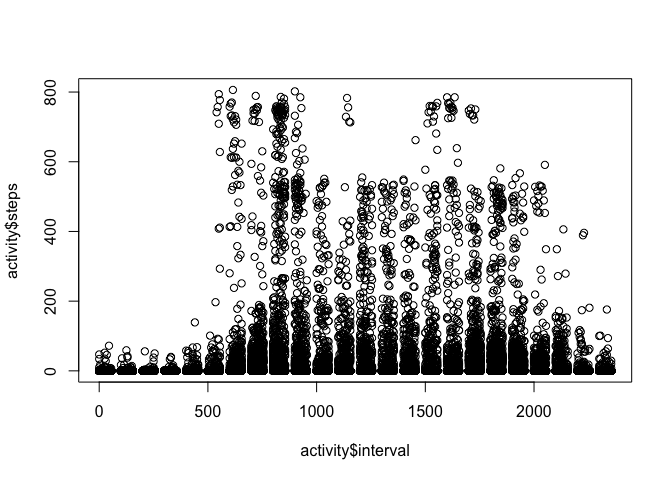

# Reproducible Research: Peer Assessment 1


## Loading and preprocessing the data

```r
library(lubridate)
if (!file.exists("activity.csv")){
        unzip("activity.zip")
}

activity <- read.csv(file = "activity.csv", colClasses=c(NA,"Date",NA), stringsAsFactors=T, header = TRUE)
```


## What is mean total number of steps taken per day?


## What is the average daily activity pattern?

1. Make a time series plot (i.e. type = "l") of the 5-minute interval (x-axis) and the average number of steps taken, averaged across all days (y-axis)


```r
plot.ts(x = activity$interval, y = activity$steps)
```

 


## Imputing missing values

1. Calculate and report the total number of missing values in the dataset (i.e. the total number of rows with NAs)


```r
summary(activity$steps)
```

```
##    Min. 1st Qu.  Median    Mean 3rd Qu.    Max.    NA's 
##    0.00    0.00    0.00   37.38   12.00  806.00    2304
```


## Are there differences in activity patterns between weekdays and weekends?
