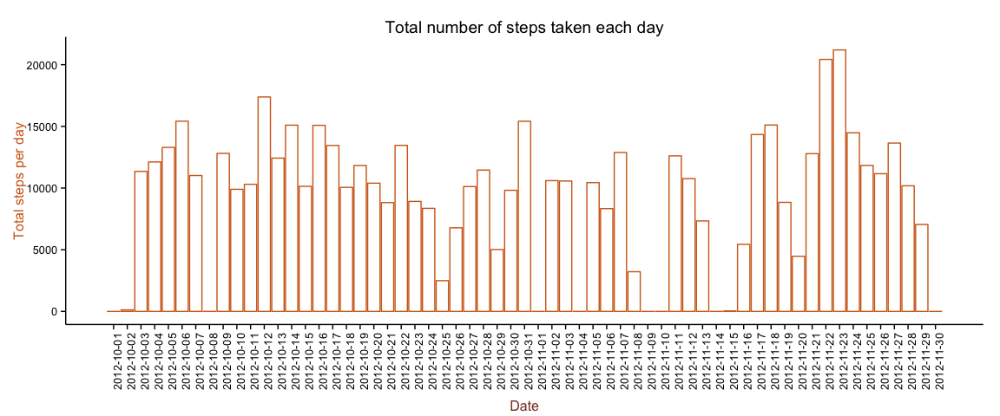

# Reproducible Research: Peer Assessment 1


## Loading and preprocessing the data

```r
if (!file.exists("activity.csv")){
        unzip("activity.zip")
}
activity <- read.csv(file = "activity.csv", colClasses=c(NA,"Date",NA), stringsAsFactors=T, header = TRUE)
```


## What is mean total number of steps taken per day?

###Total number and mean of steps taken per day

```r
library(plyr)

activityPerDay <- ddply(.data = activity, .(date), summarize, stepsPerDay=sum(steps,na.rm = TRUE))
```

###Make a histogram of the total number of steps taken each day

The difference between a histogram and a barplot was researched, based my graph after readying the following pages:

* [Histograms vs Bar Graphs](http://www.shodor.org/interactivate/discussions/HistogramsVsBarGraph/)
* [Plotting distributions (ggplot2)](http://www.cookbook-r.com/Graphs/Plotting_distributions_(ggplot2)/) 
* [GGPlot Histogram](http://docs.ggplot2.org/current/geom_histogram.html)


```r
library(ggplot2)
g <- ggplot(activityPerDay) 
g <- g + geom_histogram(binwidth=.5, position="identity", aes(x=date, y=stepsPerDay), stat="identity")
g <- g + labs("Total number of steps taken each day", "Date", "Total steps per day")
g <- g + scale_x_date(breaks = activityPerDay$date)
g <- g + theme_classic() + theme(axis.text.x = element_text(angle=90, hjust=1))

histogramStepsPerDay <- g
# show
histogramStepsPerDay
```

 


###Calculate and report the mean and median of the total number of steps taken per day

```r
library(plyr)
activityPerDay <- ddply(.data = activity, .(date), summarize, stepsPerDay=sum(steps,na.rm = TRUE), mean= ifelse(is.na(mean(steps, na.rm = T)),0,round(mean(steps, na.rm=T),2)) , median= ifelse(is.na(median(steps, na.rm = T)),0,median(steps, na.rm=T)) )
kable(activityPerDay, col.names = c("Date", "Total steps per day", "Mean", "Median"))
```


Date          Total steps per day    Mean   Median
-----------  --------------------  ------  -------
2012-10-01                      0    0.00        0
2012-10-02                    126    0.44        0
2012-10-03                  11352   39.42        0
2012-10-04                  12116   42.07        0
2012-10-05                  13294   46.16        0
2012-10-06                  15420   53.54        0
2012-10-07                  11015   38.25        0
2012-10-08                      0    0.00        0
2012-10-09                  12811   44.48        0
2012-10-10                   9900   34.38        0
2012-10-11                  10304   35.78        0
2012-10-12                  17382   60.35        0
2012-10-13                  12426   43.15        0
2012-10-14                  15098   52.42        0
2012-10-15                  10139   35.20        0
2012-10-16                  15084   52.38        0
2012-10-17                  13452   46.71        0
2012-10-18                  10056   34.92        0
2012-10-19                  11829   41.07        0
2012-10-20                  10395   36.09        0
2012-10-21                   8821   30.63        0
2012-10-22                  13460   46.74        0
2012-10-23                   8918   30.97        0
2012-10-24                   8355   29.01        0
2012-10-25                   2492    8.65        0
2012-10-26                   6778   23.53        0
2012-10-27                  10119   35.14        0
2012-10-28                  11458   39.78        0
2012-10-29                   5018   17.42        0
2012-10-30                   9819   34.09        0
2012-10-31                  15414   53.52        0
2012-11-01                      0    0.00        0
2012-11-02                  10600   36.81        0
2012-11-03                  10571   36.70        0
2012-11-04                      0    0.00        0
2012-11-05                  10439   36.25        0
2012-11-06                   8334   28.94        0
2012-11-07                  12883   44.73        0
2012-11-08                   3219   11.18        0
2012-11-09                      0    0.00        0
2012-11-10                      0    0.00        0
2012-11-11                  12608   43.78        0
2012-11-12                  10765   37.38        0
2012-11-13                   7336   25.47        0
2012-11-14                      0    0.00        0
2012-11-15                     41    0.14        0
2012-11-16                   5441   18.89        0
2012-11-17                  14339   49.79        0
2012-11-18                  15110   52.47        0
2012-11-19                   8841   30.70        0
2012-11-20                   4472   15.53        0
2012-11-21                  12787   44.40        0
2012-11-22                  20427   70.93        0
2012-11-23                  21194   73.59        0
2012-11-24                  14478   50.27        0
2012-11-25                  11834   41.09        0
2012-11-26                  11162   38.76        0
2012-11-27                  13646   47.38        0
2012-11-28                  10183   35.36        0
2012-11-29                   7047   24.47        0
2012-11-30                      0    0.00        0

## What is the average daily activity pattern?

1. Make a time series plot (i.e. type = "l") of the 5-minute interval (x-axis) and the average number of steps taken, averaged across all days (y-axis)


```r
averageByInterval <- ddply(.data = activity, .(interval), summarize, mean=mean(steps, na.rm=T ))

with(averageByInterval,{
        plot(mean ~ interval, type="l")
        abline(v=averageByInterval[averageByInterval$mean==max(averageByInterval$mean),"interval"], col="purple")
        legend(x="topright", cex=0.75, c("Interval with max # of steps"), col=c("purple"), lty=c(1), bty="n")
})
```

 

2. Which 5-minute interval, on average across all the days in the dataset, contains the maximum number of steps?

```r
averageByInterval[averageByInterval$mean==max(averageByInterval$mean),]
```

```
##     interval     mean
## 104      835 206.1698
```


## Imputing missing values

1. Calculate and report the total number of missing values in the dataset (i.e. the total number of rows with NAs)


```r
summary(activity$steps)["NA's"]
```

```
## NA's 
## 2304
```

2. Devise a strategy for filling in all of the missing values in the dataset. The strategy does not need to be sophisticated. For example, you could use the mean/median for that day, or the mean for that 5-minute interval, etc.

Given that I calculated the mean values in `activityPerDay`, I will use those to replace `NA`, by performing the equivalent of a relational _left join_, and then projecting the right values into the columns. 

3. Create a new dataset that is equal to the original dataset but with the missing data filled in.


```r
merged <- merge(activity, activityPerDay, by="date", all.x=T)
fixed0 <- merged[,c("date","interval","mean","steps")]
fixed <- ddply(fixed0, .(date, interval), function(r){ c(ifelse(is.na(r$steps),r$mean,r$steps))})
colnames(fixed) <- c("date","interval","steps")
```

4. Make a histogram of the total number of steps taken each day and Calculate and report the mean and median total number of steps taken per day. 


```r
library(ggplot2)
activityPerDayFixed <- ddply(.data = activity, .(date), summarize, stepsPerDay=sum(steps,na.rm = TRUE))
g <- ggplot(activityPerDayFixed) 
g <- g + geom_histogram(binwidth=.5, position="identity", aes(x=date, y=stepsPerDay), stat="identity")
g <- g + labs("Total number of steps taken each day", "Date", "Total steps per day")
g <- g + scale_x_date(breaks = activityPerDayFixed$date)
g <- g + theme_classic() + theme(axis.text.x = element_text(angle=90, hjust=1))
# show

histogramStepsPerDayFixed <- g

g
```

 

4. a) Do these values differ from the estimates from the first part of the assignment? 

They do not seem to differ.


```r
# based on http://zevross.com/blog/2014/08/04/beautiful-plotting-in-r-a-ggplot2-cheatsheet-3/#put-two-potentially-unrelated-plots-side-by-side-pushviewport
library(grid)
pushViewport(viewport(layout = grid.layout(2, 1)))
print(histogramStepsPerDay, vp = viewport(layout.pos.row = 1, layout.pos.col = 1))
print(histogramStepsPerDayFixed, vp = viewport(layout.pos.row = 2, layout.pos.col = 1))
```

 

4. b) What is the impact of imputing missing data on the estimates of the total daily number of steps?

Given my initial load/cleanup of data (not taking NAs in account), the first histogram and the histogram resulting from inputing the data do not differ.

## Are there differences in activity patterns between weekdays and weekends?

1. Create a new factor variable in the dataset with two levels – “weekday” and “weekend” indicating whether a given date is a weekday or weekend day.

```r
library(stringr)

activity <- transform(activity, typeOfDay=ifelse(str_detect(weekdays(date),"Sunday|Saturday"),"weekend","weekday"))
```

2. Make a panel plot containing a time series plot (i.e. type = "l") of the 5-minute interval (x-axis) and the average number of steps taken, averaged across all weekday days or weekend days (y-axis). 


```r
library(plyr)
library(lattice)

averageByIntervalWeekdays <- ddply(.data = activity, .(interval, date), summarize, mean=mean(steps, na.rm=T ), typeOfDay=typeOfDay)

par(mfrow = c(1,2))
xyplot(mean ~ interval | typeOfDay, averageByIntervalWeekdays, type="l", xlab = "Interval", ylab="Number of Steps")
```

 

